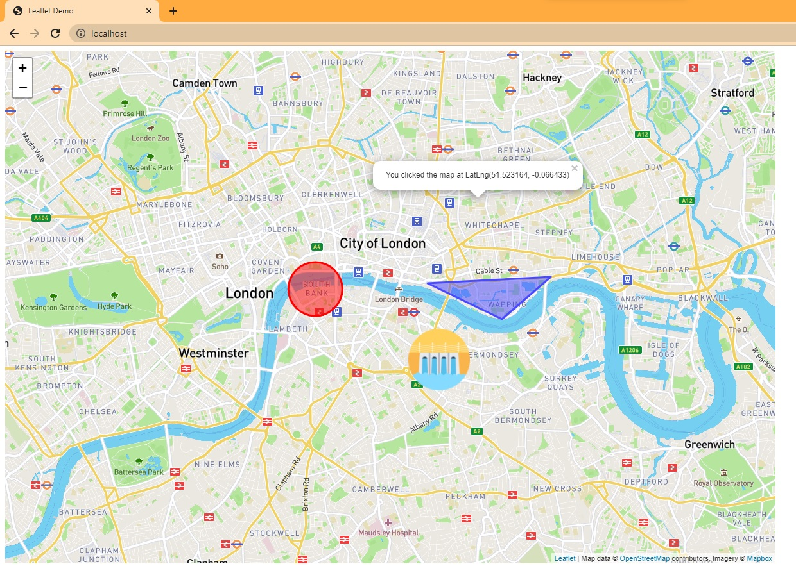

# Water Management and Simulation Software

A visualization tool for the WHAT-IF model

WHAT-IF can be found here: https://github.com/RaphaelPB/WHAT-IF

## Requirements
- A functioning web server
- Internet Connection
- A web broswer

## Installation

1. Create a functioning web sever
    * There are plenty of tutorials out there on how to setup a webserver, however it is pretty simple on Windows 10
    * Select the Start Menu and search for "Turn Windows features on or off"
    * In Windows Features, check the box that says "Internet Information Services"
    * Select 'OK'. You computer may need to reboot after this.
    * After completeing those steps, a new folder will be created in your file system called C:\inetpub.
2. Copy WMASS to the web server
    * Download or clone the WMASS files
    * Copy all the files from the WMASS folder to C:\inetpub\wwwroot

Congratulations, you have installed WMASS


## Usage

* Type in the web address of your webserver into a browser. If you installed a websever locally, or by using the tutorial above, the web address will be http://localhost



* Click anywhere on the map to display the latitude and longitude of that location
* Click on the circle and enter a number between 0 and 255 it to red. The higher the number, the more red it becomes
* Click on the triangle to pull up a slider that will allow you to change the color of it to blue. Drag the slider to the right to make it more blue
* Marker objects can be dragged around, Click on the marker to display it's properties.

## Objects.json
Users can create their own objects for WMASS within the objects.json file.
There are a set number of properties icons have to have, everything else is up to the user.
An example object of a hydro electric power plant has already been included.

```json
    "HydroPowerPlant":{
        "imgPath":"./icons/hydroElectricPP.png",
        "iconSize": [96, 96],
        "iconAnchor": [48, 48],
        "popupAnchor": [0, -30],
        "powerProduction":"0.85 dollars/kwh"
    }
```
### Required properties
* imgPath: the file path to the image used for the icon. We recommend placing these icons in the icons folder
* iconSize: This is the length and width of the marker. This will vary based on the image as well as how big you want the marker to be.
* iconAnchor: This is the location on the marker that the image will align with. This will also vary based on the image you choose
* popupAnchor: The location in the marker where the pop up containing all the property information comes from. This too will vary based on the image, and well as personal preference.

## Contributing
Pull requests are welcome. For major changes, please open an issue first to discuss what you would like to change.

## Contributers
[Alex Fricke](https://github.com/aafricke), [Alex Ross](https://github.com/alexleroyross), [Dan Keesling](https://github.com/dpkeesling), [Noah Schram](https://github.com/nsschram), and [Stephen Vickery](https://github.com/sjvickery)

Special thanks to [Raphaël Payet-Burin](https://github.com/RaphaelPB), who is the creator of the WHAT-IF model. He worked with our team and helped us understand how the model worked.

## License
[MIT](https://choosealicense.com/licenses/mit/)